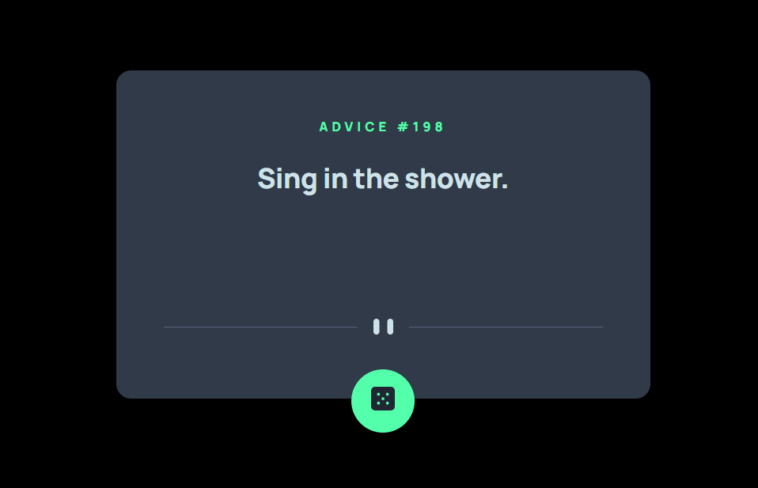

# Advice generator 

This project is a simple web application that generates random advice messages when a button is clicked. It uses HTML, CSS, and JavaScript to display the advice on the screen.

## Preview

## Usage

To use the Advice Generator, follow these steps:

1. Clone or download the project repository.
2. Open the `index.html` file in a web browser.
3. Click the "Generate Advice" button to fetch and display a random advice message.
4. Click the button again to generate a new advice message.

Alternatively, you can also access a live demo of the Advice Generator by visiting the GitHub Pages [link for the project](https://kgogina.github.io/advice_generator/). This allows you to use the application directly in your web browser without the need to clone or download the repository.

## HTML Structure

The HTML file `index.html` contains the structure of the web page. It consists of the following elements:

- `<head>`: Contains meta information and links to external stylesheets.
- `<body>`: Contains the main content of the page.
  - `<section class="main-box">`: Represents the main container of the advice generator.
    - `
`: Displays the advice number.
    - `
`: Displays the advice message.
    - `
`: Contains an image element for decoration.
    - `<button type="button" class="btn" id="submit">`: Generates a new advice message when clicked.

## JavaScript Logic

The JavaScript file `script.js` contains the logic for fetching and displaying the advice messages. It consists of the following functions:

- `fetchAdvice()`: Sends a request to the Advice Slip API to fetch a random advice message. It updates the `number` and `text` elements in the HTML with the fetched advice data.
- Event Listener: The script attaches an event listener to the "Generate Advice" button. When clicked, it calls the `fetchAdvice()` function to generate a new advice message.

## CSS Styles

The CSS styles for the project are defined in the `style.css` and `style_mobile.css` files. They control the appearance and layout of the advice generator. The styles include:

- Custom font import from Google Fonts.
- Definition of CSS variables for color values.
- Styling for the main container, advice text, and number.
- Responsive design using media queries for smaller screens.

Please note that this project uses external resources such as images and API endpoints. Make sure you have an internet connection to access these resources properly.

## Acknowledgements
Special thanks to Frontend Mentor for providing the task/project that served as the basis for this code.
The project was created for learning purposes and does not represent a real company or offer real services. 

